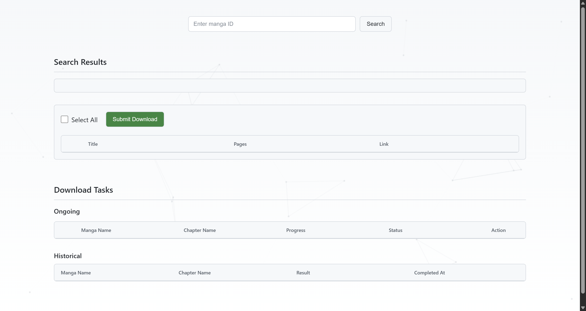
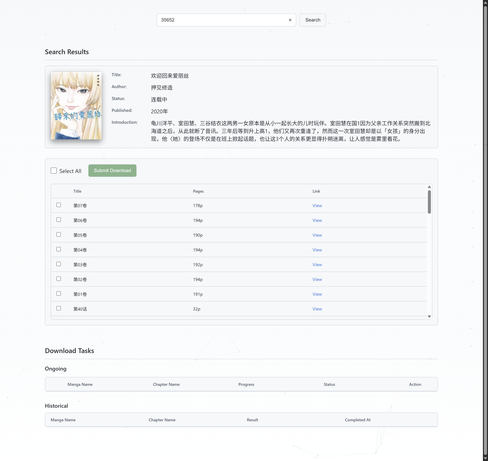
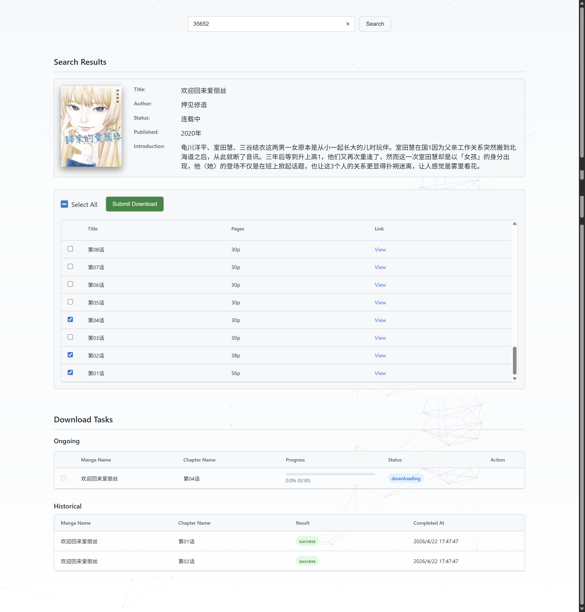

# 漫画柜

## 使用方法

### 第一步: 生成配置文件

执行如下命令，生成配置文件：

```bash
./mhg -t
```

在当前工作目录下会生成一个名为 `config.json` 的配置文件。其内容如下：

```json
{
  "ApiServerPort": 8080,
  "Retry": 5,
  "Cookie": "",
  "SaveDir": "path to save, e.g., ./downloads",
  "Proxy": "http proxy address, e.g., http://localhost:10808",
  "ScriptLocation": "",
  "Concurrency": 3,
  "Timeout": 60000,
  "Overwrite": false
}
```

### 第二步: 修改配置文件

根据需要修改配置文件中的字段：

| 字段             | 说明                                  |
|----------------|-------------------------------------|
| ApiServerPort  | 必须项，API 服务器监听的端口号                   |
| Retry          | 可选项*，下载失败时的重试次数                     |
| Cookie         | 可选项                                 |
| SaveDir        | 必须项， 漫画下载后的保存路径                     |
| Proxy*         | 可选项，HTTP 代理地址，如果你的地区无法直接访问源，该配置是必要的 |
| ScriptLocation | 可选项                                 |
| Concurrency    | 可选项，下载的并发数                          |
| Timeout        | 可选项，下载超时时间，单位为毫秒                    |
| Overwrite      | 可选项，是否覆盖已存在的文件                      |

> ⚠️ *Proxy: 如不配置代理，您需将 `Proxy` 字段置为空字符串 `""`

> ♿ *可选项: 对于上述表格中的“可选项”，您可以将其从配置文件中移除，程序会使用默认值

### 第三步: 运行程序

执行如下命令，程序会使用当前工作目录下的 `config.json` 配置文件进行运行：

```bash
./mhg -s
```

你也可以通过 `-c` 参数指定配置文件路径：

```bash
./mhg -c <path/to/config.json> -s
```

程序启动完成后，访问`http://localhost:8080`*，你会看到一个简单的`WebUI`，在其中输入漫画`ID`即可开始下载。

> ⚠️ *8080: 你需要将 `8080` 替换为你在配置文件中设置的 `ApiServerPort` 字段的值


### 第四步：查询漫画并提交下载任务

#### 访问`WebUI`



#### 输入漫画`ID`并查询




#### 选择章节并提交下载任务

